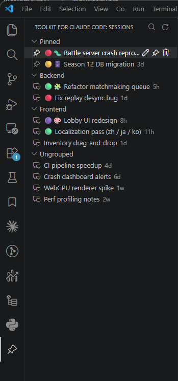

# Toolkit for Claude Code

**English** | [简体中文](README.zh-CN.md)

Quality-of-life enhancements for the official [Claude Code](https://marketplace.visualstudio.com/items?itemName=anthropic.claude-code) VSCode extension. Browse, pin, search, rename, color-code, and group your Claude Code sessions from a dedicated sidebar.

> **Unofficial, community add-on** — not affiliated with Anthropic. It runs alongside the official Claude Code extension and never modifies its files.

## Features

- 📌 **Pin** important sessions to a top group so they never get buried by newer ones.
- 🗂️ **Date grouping** — Today / Yesterday / Previous 7 Days / Previous 30 Days / Older.
- 📁 **Custom groups** — organize sessions into your own groups; once you use them, the list groups by them (Pinned → your groups → Ungrouped) instead of by date.
- 🎨 **Color dots** and 😀 **emoji** per session, shown at the start of the label.
- 🔍 **Search** sessions by name (search icon, or "Search Sessions" in the command palette).
- ✏️ **Rename** sessions, 🗑️ **delete** them (to the trash), and 📋 **copy** their ID / transcript path.
- 🖱️ **Open** a session with one click — it reuses the official extension's own open command, so it opens exactly as it would natively.
- 🔄 Auto-refreshes as sessions change, plus a manual refresh button.

## Requirements

The official **Claude Code** extension (`anthropic.claude-code`) must be installed and enabled — Toolkit reuses its "open session" command.

## Install

Search **"Toolkit for Claude Code"** in the VS Code Extensions view, or install from the [Marketplace](https://marketplace.visualstudio.com/items?itemName=sssooonnnggg.claudecode-toolkit).

Then click the **pushpin icon** in the activity bar, open a workspace where you've used Claude Code, and your sessions appear. Hover a row for inline actions (rename, pin, delete); right-click for color, emoji, group, and copy.

## How it works

Toolkit reads Claude Code's local session transcripts from `~/.claude/projects/<encoded-workspace>/*.jsonl` (read-only) to build the list, and derives each session's title from its first prompt. Your pins, names, colors, emojis, and groups are stored in this extension's own VS Code storage.

## Privacy

Everything stays on your machine. Toolkit only reads local files under `~/.claude/projects`, stores its settings locally, and makes **no network requests**.

## Roadmap

This extension is a home for small Claude Code enhancements. Ideas under consideration: export a session to Markdown, an all-projects view, sort options, and localization. Suggestions and bug reports welcome via [issues](https://github.com/sssooonnnggg/claude-code-toolkit/issues).

## License

[MIT](LICENSE)
